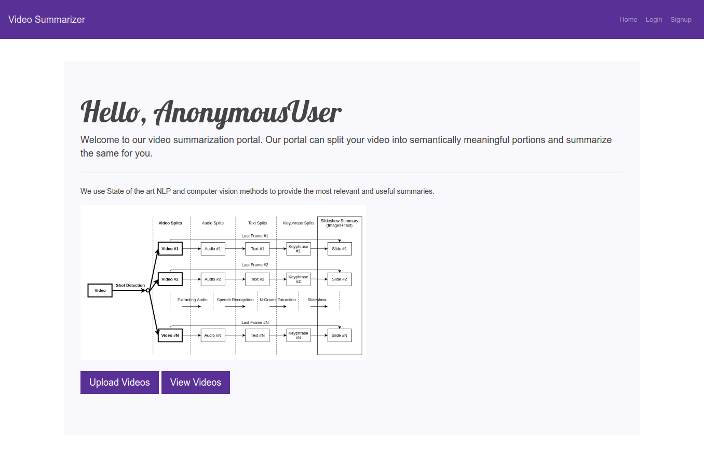
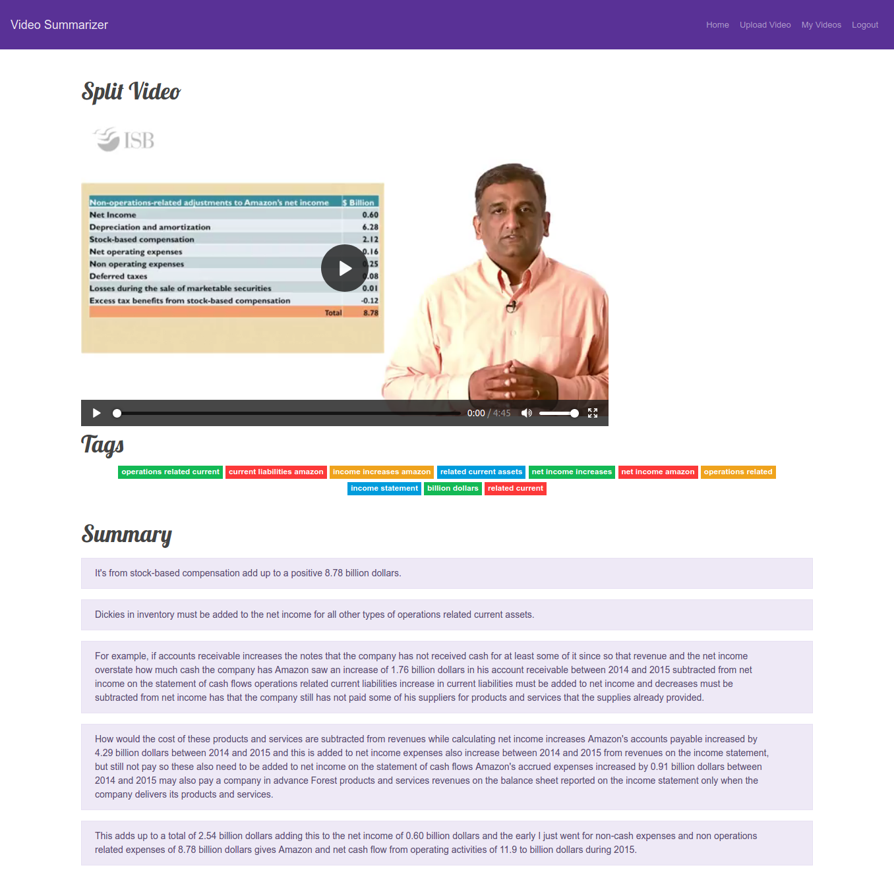

## AI Based Lecture Summarization Tool

---
### Problem Statement
This is a web application that can automatically summarize lecture videos using AI, computer vision & NLP. It leverages the latest advances in machine learning (speech recognition) ,, computer vision (shot detection) & NLP (summarization) to summarize online lecture videos and make the videos indexable by using tag search.

In essence, we have done the following:
1. Given a video (uploaded by the users), we split it into several meaningful short sections/clips based on visual cues
2. For each clip, we generate the captions of the lecture video using deep learning models for speech recognition
3. We generate keywords and a summary for each of the above clips using extractive and descriptive summarization tools
4. The short clips are then indexed using the corresponding keywords and can be searched by the user using a web UI

### Important Modules

The code is completely modularized and written using clean code principles.
* [shot_detection](videoSummarizer/shot_detection/): It contains the code for automatic detection of transitions between shots in a given video. In our case, we have used the PySceneDetect library for the same but have created an interface [ShotDetectionInterface](videoSummarizer/shot_detection/ShotDetectionInterface.py) so that if needed, the work can be extended to use other open source libraries as well. The module also splits the original video according to the splits.
* [audio_generation](videoSummarizer/audio_generation/): It contains the code for extraction of audio out of each individual video clips using FFMPEG.
* [speech_recognition](videoSummarizer/speech_recognition/): Speech recognition refers to the task of converting the audio into corresponding text. We have used Google Speech Recognition API for the same due to availability of free credits but have created an interface [SpeechRecognitionInterface](videoSummarizer/speech_recognition/SpeechRecognitionInterface.py) so that if needed, the work can be extended to APIs provided by Microsoft, Amazon, etc.
* [summarization](videoSummarizer/summarization/): The module performs the automatic text summarization. We have used [Yake](https://github.com/LIAAD/yake) for the same but have created an interface [SummarizationInterface](videoSummarizer/summarization/SummarizationInterface.py) so that if needed, the work can be extended to other summarization models like [WordFrequencySummarizer](videoSummarizer/summarization/WordFrequencySummarization.py)

### Unit Testing
Each of the above modules have their test files in their respective folders.
* [Test for shot detection](videoSummarizer/shot_detection/test_pyscene.py)
* [Test for audio generation](videoSummarizer/audio_generation/test_audio_generation.py)
* [Test for speech recognition](videoSummarizer/speech_recognition/test_google.py)
* [Test for summarization](videoSummarizer/summarization/test_yake.py)

### User Interface
Some screenshots from the web application.


### Install Dependencies
Run from root.
* ```pip install -r videoSummarizer/requirements.txt```

### Steps To Run
Follow these steps from the root.
* Create a database named 'VideoSummarizer':

  ```
  mysql -u root -p
  create database VideoSummarizer
  ```
* In [videoSummarizer](videoSummarizer/videoSummarizer) folder, change the *mysql.cnf*  file according to your mysql details.

* In [settings.py](videoSummarizer/videoSummarizer/settings.py) file, add path of the above *mysql.cnf* file in ``` read_default_file```  field.

* Add tables to your database using :

   ``` python videoSummarizer/manage.py migrate```

* Run the server using:

   ``` python videoSummarizer/manage.py runserver```

* You can create a superuser using:

  ```python videoSummarizer/manage.py createsuperuser```

### Coding Standards and Design Pattern
* We have implemented Model View Template(MVT) design pattern. The Model is the logical data structure behind the entire application and is represented by a database. The View is the user interface and template consists of static parts of the HTML output as well as describes how dynamic content will be inserted.
* Our application follows object oriented paradigm, which is a sub category of imperative programming paradigm. Interfaces and objects are created for each of the sub modules.
* We have abstracted according to the problem defined in the [design document](documents/design_document.pdf).
* Function names are self explainatory and docstrings are provided wherever necessary. Functions are small(7-10 lines) and have one level of abstraction.
* The code of different sub modules is easily extendile to other APIs and libraries.
* Exceptions are handled by using try except blocks.
* We have followed SOLID design principles.

### General Instructions

* A user can upload videos only when he/she is logged in.
* Uploaded videos should not be larger than 100 MB in size.
* Code is written in **python3**.

### Design Theme
* [Bootswatch](https://bootswatch.com/pulse/)

### Collaborators
This project would not have been possible without the help of following collaborators
* [Gulshan Mittal](https://github.com/gulshan-mittal)
* [Himanshu Bhatia](https://github.com/Him98)
* [Nitesh Gupta](https://github.com/guptanitesh)
* [Shreya](https://github.com/shreyaUp)
* [Akansha](https://github.com/akanksha212)